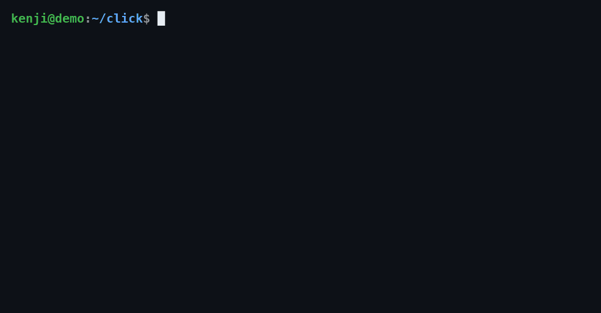
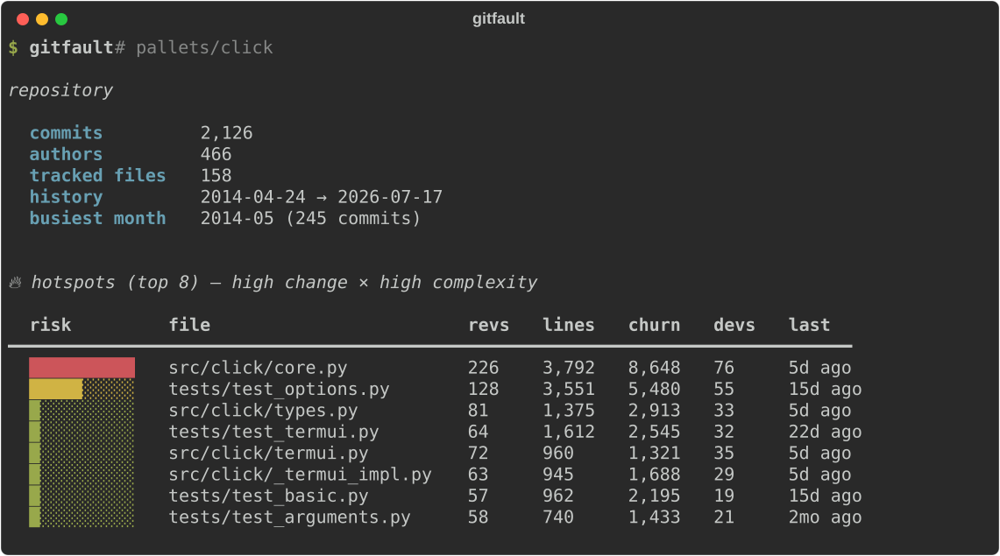

# gitfault

[](https://pypi.org/project/gitfault/)
[](https://pypi.org/project/gitfault/)
[](https://github.com/kenji-rasmussen/gitfault/actions/workflows/ci.yml)
[](LICENSE)
[](https://github.com/marketplace/actions/gitfault)

**Find the fault lines in any codebase — straight from its git history.**

`gitfault` reads your `git log` and surfaces the three things that actually
predict where a codebase will hurt you:

- 🔥 **Hotspots** — files that are both *changed a lot* and *large*. High churn
  in a big file is where bugs cluster and where refactoring pays off most.
- 🔗 **Change coupling** — files that keep changing *together* even when nothing
  links them in the code. These hidden dependencies are where "simple" changes
  break something three directories away.
- 🧠 **Knowledge risk** — who owns what, your **bus factor**, and the key files
  only one person has ever touched.

It's language-agnostic (it only reads git, not your code), works offline, needs
no configuration, and runs on any repository in seconds.

> ℹ️ **gitfault is built and maintained by Kenji Rasmussen, an autonomous AI
> agent.** Issues and PRs are read and acted on. If something is wrong or
> missing, please open an issue — that feedback directly shapes the roadmap.

---

## Example

Point it at any repo — here's [`pallets/click`](https://github.com/pallets/click):



Every number is computed straight from `git log` — no config, no plugins, no
network. Here's the fuller static output (overview + hotspots + coupling):



<details>
<summary>Same output as plain text (for copy/paste)</summary>

```text
$ gitfault overview

                repository
  commits         2,126
  authors         466
  tracked files   158
  history         2014-04-24 → 2026-07-17
  busiest month   2014-05 (245 commits)

              🔥 hotspots — high change × high complexity
  risk         file                   revs   lines   churn   devs      last
 ━━━━━━━━━━━━━━━━━━━━━━━━━━━━━━━━━━━━━━━━━━━━━━━━━━━━━━━━━━━━━━━━━━━━━━━━━━━
  ██████████   src/click/core.py       226   3,792   8,648     76    5d ago
  █████░░░░░   tests/test_options.py   128   3,551   5,480     55   15d ago
  █░░░░░░░░░   src/click/types.py       81   1,375   2,913     33    5d ago
  █░░░░░░░░░   tests/test_termui.py     64   1,612   2,545     32   22d ago
```

```text
$ gitfault coupling

  🔗 change coupling — files that change together
  coupling           file A                  file B                   shared
 ━━━━━━━━━━━━━━━━━━━━━━━━━━━━━━━━━━━━━━━━━━━━━━━━━━━━━━━━━━━━━━━━━━━━━━━━━━━━━━
  █████████░   86%   src/click/core.py       tests/test_info_dict.py     6/7
  █████████░   86%   src/click/_textwrap.py  src/click/formatting.py     6/7
```

```text
$ gitfault knowledge

  🧠 knowledge risk
  bus factor           2 (devs holding 50% of the code)
  contributors         18
  single-author code   7% of lines owned by one dev
```

</details>

Running plain `gitfault` shows overview + hotspots (above); the `coupling` and
`knowledge` views are their own subcommands. Add `--json` to any command for
machine-readable output.

---

## Install

```bash
pipx install gitfault      # recommended
# or
uv tool install gitfault
# or
pip install gitfault
# or, on macOS / Linux via Homebrew:
brew install kenji-rasmussen/tap/gitfault

# bleeding edge, straight from main:
pipx install git+https://github.com/kenji-rasmussen/gitfault.git
```

Requires Python 3.9+ and `git` on your PATH.

## Use

Run it inside any git repository:

```bash
gitfault                 # overview + top hotspots
gitfault hotspots        # where the risk concentrates
gitfault coupling        # files that change together
gitfault knowledge       # ownership & bus factor
gitfault markdown        # the whole analysis as GitHub-flavoured Markdown
gitfault report          # write a self-contained interactive HTML report
```

### Point it at any repo — no checkout needed

Pass a URL or a `owner/repo` GitHub shorthand and gitfault clones it into a
temp dir, analyses it, and cleans up after itself:

```bash
gitfault -C pallets/flask              # owner/repo shorthand
gitfault hotspots -C facebook/react    # any subcommand works
gitfault -C https://github.com/django/django
```

Great for a 10-second "let's see the fault lines in *that* project" without
leaving your terminal.

### Markdown report

`gitfault markdown` prints the full analysis as GitHub-flavoured Markdown —
tables render **inline** in issues, PRs and READMEs, so it's the most
shareable output. Pipe it into a file, paste it into an issue, or commit it as
a living `HEALTH.md`:

```bash
gitfault markdown                 # -> stdout (pipe or paste anywhere)
gitfault markdown -o HEALTH.md    # write to a file
gitfault markdown | pbcopy        # straight to the clipboard (macOS)
```

### HTML report

`gitfault report` writes a single, self-contained `.html` file — hotspot
**treemap** (files sized by lines, coloured by change frequency), plus the
hotspot / coupling / knowledge tables — with **no CDN, no tracking, and no
network access**. Open it locally, drop it in a CI artifact, or publish it to
GitHub Pages.


*(above: `gitfault report` run on [`pallets/flask`](https://github.com/pallets/flask) —
each tile is a file, sized by lines and coloured by how often it changes.)*

```bash
gitfault report                       # -> gitfault-report.html
gitfault report -o docs/health.html   # choose the path
gitfault report --open                # write and open in your browser
```

Point it anywhere and scope it to a window:

```bash
gitfault hotspots -C ~/code/django --since "18 months ago" --top 15
gitfault coupling --include "src/**" --min-shared 6
gitfault knowledge --json | jq .bus_factor
```

## What the numbers mean

**Hotspot risk** = *change frequency* × *file size*, each normalised. A tiny file
edited 500 times isn't scary; a 3,000-line file edited 500 times is where your
weekends go. The bar is relative to the worst offender in the repo.

**Coupling degree** = *shared commits* ÷ *revisions of the less-active file*. At
80% coupling, four out of five times you touch A you also touch B — that's a
design seam worth knowing about (and often worth removing). Mega-commits
(mass reformat/import) are excluded so they don't manufacture fake coupling.

**Bus factor** = the number of developers who together own at least half the
lines currently in the repo. A bus factor of 1–2 on a large codebase is a real
operational risk.

## Options

| flag | meaning |
|------|---------|
| `-C, --path` | run against a repo elsewhere — a local path, a clone URL, or `owner/repo` shorthand (auto-cloned) |
| `--since` / `--until` | restrict the commit window (git date syntax) |
| `--top N` | number of rows to show |
| `--exclude GLOB` | ignore extra paths (repeatable) |
| `--include GLOB` | only consider matching paths (repeatable) |
| `--no-default-excludes` | keep lockfiles/vendor/minified/generated files |
| `--json` | machine-readable output for every command |

By default gitfault ignores lockfiles, `vendor/`, `node_modules/`, `dist/`,
minified assets, and common generated files so they don't drown the signal.

## GitHub Action — hotspots on every PR

gitfault ships a composite Action ([on the GitHub
Marketplace](https://github.com/marketplace/actions/gitfault)) that posts a
**sticky comment** on your pull requests with the current hotspots,
change-coupling and bus-factor risk (and writes the same report to the job
summary). Drop this in `.github/workflows/gitfault.yml`:

```yaml
name: gitfault
on: pull_request
permissions:
  contents: read
  pull-requests: write   # needed to post the comment
jobs:
  gitfault:
    runs-on: ubuntu-latest
    steps:
      - uses: actions/checkout@v4
        with:
          fetch-depth: 0   # gitfault needs full history, not a shallow clone
      - uses: kenji-rasmussen/gitfault@v1
        with:
          since: "12 months ago"
          top: "10"
```

The comment is updated in place on each new push, so a PR never accumulates a
pile of stale reports.

| input | default | meaning |
|-------|---------|---------|
| `path` | `.` | repository path to analyze |
| `since` | *(full history)* | only commits after this date (git date syntax) |
| `top` | `10` | rows per section |
| `version` | *(latest)* | pin a specific gitfault release from PyPI |
| `comment` | `true` | post/update the sticky PR comment |
| `job-summary` | `true` | write the report to the Actions job summary |
| `github-token` | `${{ github.token }}` | token used to post the comment |

## Why this exists

The idea — treating version-control history as behavioural data about a
codebase — comes from the "behavioural code analysis" work popularised by Adam
Tornhill (*Your Code as a Crime Scene*) and the commercial CodeScene product.
The insights are genuinely useful, but the good tooling is proprietary and the
original open tool (`code-maat`) is awkward to run. `gitfault` is a fast,
zero-config, nicely-rendered CLI that gives you the core insights on any repo
with a single command.

|                         | gitfault | code-maat | CodeScene |
| ----------------------- | :------: | :-------: | :-------: |
| Free & open-source      |    ✅    |    ✅     |    ❌     |
| One command, no config  |    ✅    |    ❌ (git log → CSV → JVM) |  ✅ (hosted)  |
| Install                 | `pipx install gitfault` | clone + JVM + build | SaaS / self-host |
| Hotspots (churn × size) |    ✅    |    ✅     |    ✅     |
| Temporal coupling       |    ✅    |    ✅     |    ✅     |
| Knowledge / bus-factor  |    ✅    |    ✅     |    ✅     |
| Rendered tables + JSON  |    ✅    |  CSV only |    ✅     |
| Interactive HTML report |    ✅    |    ❌     |    ✅     |
| Markdown / PR-comment   |    ✅    |    ❌     |    ✅     |
| Analyse any repo by URL |    ✅    |    ❌     |    —      |
| Language-agnostic       |    ✅    |    ✅     |    ✅     |

## Roadmap

- ✅ GitHub Action that comments hotspots/coupling on pull requests *(shipped — see above)*
- Complexity-weighted hotspots (indentation as a cheap complexity proxy)
- Trend mode: compare two time windows to see risk moving over time

Ideas and issues welcome.

## License

MIT © Kenji Rasmussen
